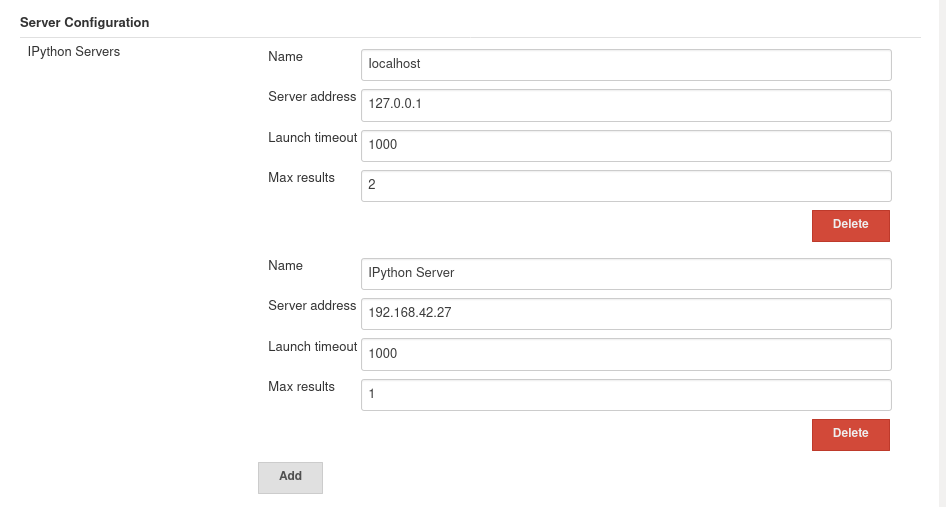
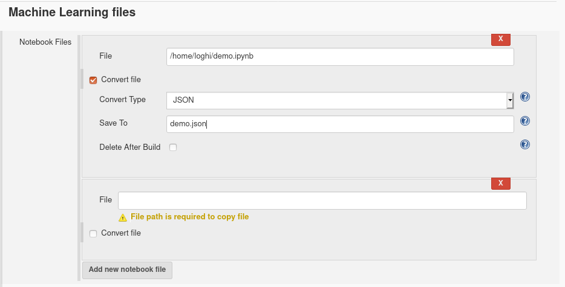
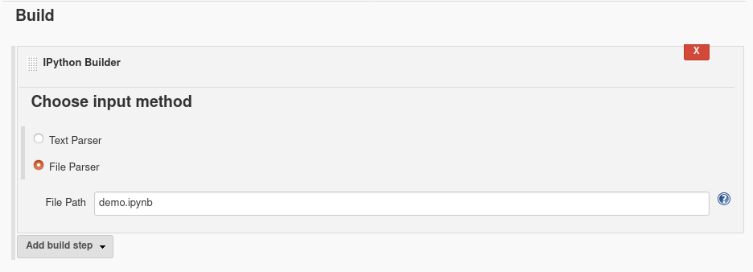

////
 ~ The MIT License

  ~ Copyright 2020 Loghi Perinpanayagam.

  ~ Permission is hereby granted, free of charge, to any person obtaining a copy
  ~ of this software and associated documentation files (the "Software"), to deal
  ~ in the Software without restriction, including without limitation the rights
  ~ to use, copy, modify, merge, publish, distribute, sublicense, and/or sell
  ~ copies of the Software, and to permit persons to whom the Software is
  ~ furnished to do so, subject to the following conditions:

  ~ The above copyright notice and this permission notice shall be included in
  ~ all copies or substantial portions of the Software.

  ~ THE SOFTWARE IS PROVIDED "AS IS", WITHOUT WARRANTY OF ANY KIND, EXPRESS OR
  ~ IMPLIED, INCLUDING BUT NOT LIMITED TO THE WARRANTIES OF MERCHANTABILITY,
  ~ FITNESS FOR A PARTICULAR PURPOSE AND NONINFRINGEMENT. IN NO EVENT SHALL THE
  ~ AUTHORS OR COPYRIGHT HOLDERS BE LIABLE FOR ANY CLAIM, DAMAGES OR OTHER
  ~ LIABILITY, WHETHER IN AN ACTION OF CONTRACT, TORT OR OTHERWISE, ARISING FROM,
  ~ OUT OF OR IN CONNECTION WITH THE SOFTWARE OR THE USE OR OTHER DEALINGS IN
  ~ THE SOFTWARE.
////

[[machine-learning-plugin]]
= Machine Learning Plugin
:toc: macro

link:https://ci.jenkins.io/job/Plugins/job/machine-learning-plugin/job/master/[image:https://ci.jenkins.io/job/Plugins/job/machine-learning-plugin/job/master/badge/icon[Build]]
link:https://github.com/jenkinsci/machine-learning-plugin/graphs/contributors[image:https://img.shields.io/github/contributors/jenkinsci/machine-learning-plugin.svg?color=blue[Contributors]]
link:https://gitter.im/jenkinsci/gsoc-machine-learning-project[image:https://badges.gitter.im/jenkinsci/machine-learning-plugin.svg[Gitter]]

== Overview

The main goal of this project is integrating Machine Learning workflow including Data preprocessing, Model Training, Evaluation and Prediction with Jenkins build tasks. This plugin will be capable of executing code fragments via IPython kernel as currently supported by Jupyter.

=== Using with Python

==== Prerequisites

- Following python libraries are required. If not -> install using,

[source,bash]
----
pip install jupyter_client
pip install ipython
pip install ipykernel
pip install protobuf
pip install grpcio
----

==== Configure IPython kernel
* Name should be alphanumeric and contains only `_` as a special character
* Valid IP address of the server (or localhost)
* Connection establishing timeout in seconds
* Max number of dataframe rows to display

==== Select server

* Configured servers will be displayed in the job configuration

==== Add Jupyter Notebooks

* Copy Jupyter Notebook to the workspace

* Convert Jupyter Notebooks to `Python / JSON` files and save in the workspace

==== Build Notebook

* Use text editor to run python code directly
* Use file path to run Jupyter Notebook or JSON

* Tips for smooth interpretation

** Install link:https://github.com/jenkinsci/ansicolor-plugin[ANSI-Color plugin] for rich formatted output
** Aware of permissions for accessing I/O in the python code
** Make sure about `import` libraries used in the code installed properly

=== Contributing to the Plugin

New feature proposals and bug fix proposals should be submitted as https://help.github.com/articles/creating-a-pull-request[GitHub pull requests].

Fork the repository on GitHub, prepare your change on your forked copy, and submit a pull request (see https://github.com/jenkinsci/machine-learning-plugin/pulls[here] for open pull requests).

Before submitting your change please note that:

* tests should be added for any changed code
* the code formatting should follow the defined standard - see Code Style
* you use findbugs to see if you haven't introduced any new warnings

Tests help us assure that we're delivering a reliable plugin, and that we've communicated our intent to other developers in a way that they can detect when they run tests.

==== Guideline for setup

1. Setup JDK 8 and Maven 3.5.*
2. Create a directory and virtual environment

    $ mkdir machine-learning-plugin
    $ virtualenv venv
    $ source venv/bin/activate
    $ which python

3. Install the prerequisites
4. Fork `jenkinsci/machine-learning-plugin` github repo
5. Clone the forked repo to local and test it

    $ git clone https://github.com/jenkinsci/machine-learning-plugin.git
    $ mvn clean install
    $ mvn hpi:run

6. Create and build job using IPython builder

==== Code Style

We try to improve the code quality by conforming to
https://google.github.io/styleguide/javaguide.html[Google Java styleguide], that is defined in
https://raw.githubusercontent.com/checkstyle/checkstyle/master/src/main/resources/google_checks.xml[google_checks.xml].
If you are using an IDE, like IntelliJ IDEA, please:

- install https://plugins.jetbrains.com/plugin/8527-google-java-format[Google Java Format plugin]

or

- install the [Checkstyle plugin](https://plugins.jetbrains.com/plugin/1065-checkstyle-idea)
- go to **Preferences > Editor > Code Style > Java**, select **Scheme** to *Project*
- click the Cog icon and import Checkstyle configuration from https://raw.githubusercontent.com/checkstyle/checkstyle/master/src/main/resources/google_checks.xml[google_checks.xml]

Currently the formatting is not automatically checked during the build. However, in the effort to
improve the quality of the code,  maintainers might ask for proper formatting during the review
process, so it is better to have it in place sooner than later.
