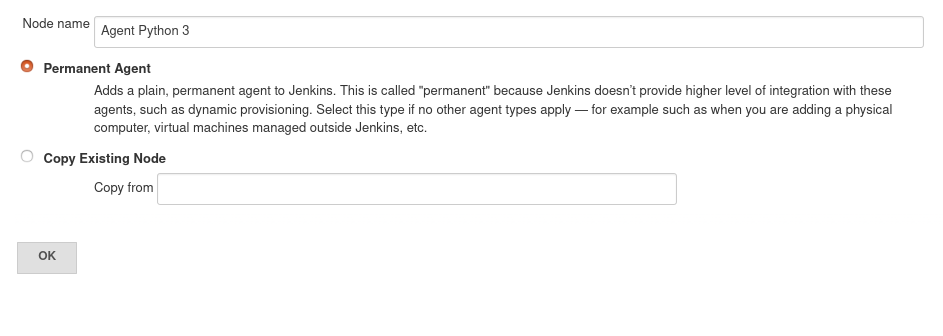
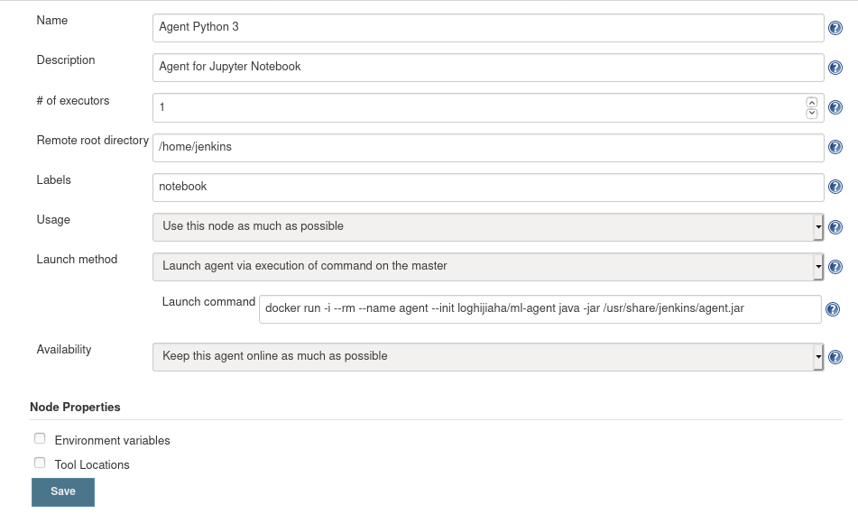
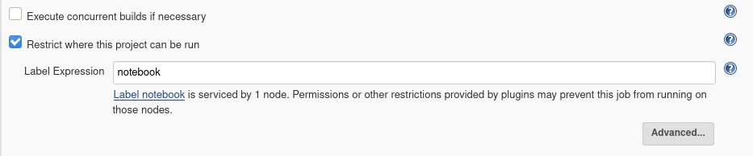
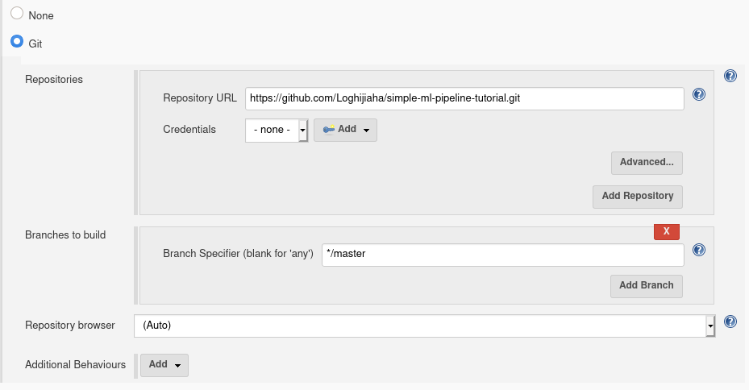
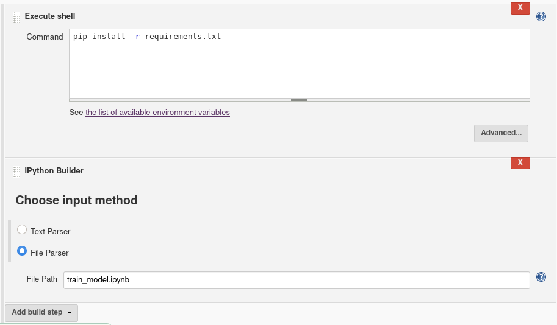

[[DcokerAgent]]
= Usage of Docker Agent
:toc: right

=== Abstract

This example will illustrate the usage of Machine Learning Plugin along with agents to execute Jupyter Notebooks in the agents' environment.

=== Preparation

Recommended plugins :

`Manage Jenkins` -> `Manage Plugins` -> Install

- Command Agent Launcher plugin
- Git plugin
- ANSI Color plugin

=== Creating new node

- `Manage Jenkins` -> `Manage Nodes` -> `New Node`

=== Configuring the node

- Node Configuration

** Set remote directory as `/home/jenkins`
** Set a label to identify the node
** Select `Launch agent via execution of command on the master`
** Set launch command as `docker run -i --rm --name agent --init loghijiaha/ml-agent java -jar /usr/share/jenkins/agent.jar`
** Save the configuration

=== Configuring IPython Kernel

Please find the below link to setup a IPython kernel. link:https://github.com/jenkinsci/machine-learning-plugin#configure-ipython-kernel[Configure a IPython kernel]

=== Configuring the job

- Select IPython instance
- Check `Restrict where this project can be run`
- Set agent label as `notebook`

==== Checkout the git repo

- Set repository URL as `https://github.com/Loghijiaha/simple-ml-pipeline-tutorial.git`

==== Add build step

- Add a `execute shell` step to install python dependencies `pip install -r requirements.txt`
- Add a IPython Builder to run `train_model.ipynb`.

=== Run the job

After saving the job configuration, Build the job to run `train_model.ipynb`.
See the entire log results in the console output.

